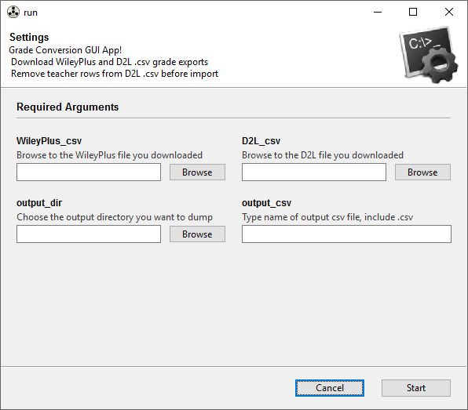

# gradeconversion
A Python script to convert grades from the WileyPlus.com online homework tool to the D2L learning management system. Uses a great Python package called [**gooey**](https://github.com/chriskiehl/Gooey) to produce a GUI that runs the script.



## Installation

Assumes you have the [Anaconda distribution of Python](https://www.anaconda.com/download/) installed and are working from the Anaconda Prompt.

```
# clone the repo

$ git clone https://github.com/ProfessorKazarinoff/gradeconversion.git

# create the conda environment

$ cd gradeconversion
$ conda env create -f environment.yml

# activate environment and pip install Gooey

$ conda activate gradeconversion
(gradeconversion)$ pip install gooey
```

## Running the Script

Assumes you have the [Anaconda distribution of Python](https://www.anaconda.com/download/) installed and are working from the Anaconda Prompt and are currently in the  ```gradeconversion``` directory.

```
$ conda activate gradeconversion

(gradeconversion)$ python run.py
```
